# Testing

> [!NOTE]  
> Return back to the [README.md](README.md) file.

## Code Validation
### HTML

I have used the recommended [HTML W3C Validator](https://validator.w3.org) to validate all of my HTML files.

| Directory | File | URL | Screenshot | Notes |
| --- | --- | --- | --- | --- |
| contact | [contact_form.html](https://github.com/Kearns55/mixing-masters/blob/main/contact/templates/contact/contact_form.html) |  https://validator.w3.org/nu/?doc=https%3A%2F%2Fmixing-masters-ee8e2a1f7802.herokuapp.com%2Fcontact%2F | 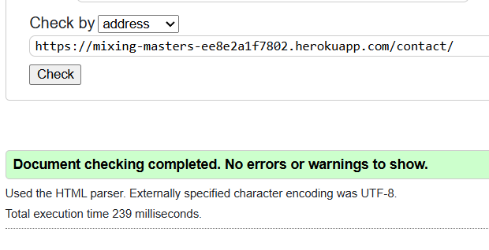 | 
| contact | [contact_success.html](https://github.com/Kearns55/mixing-masters/blob/main/contact/templates/contact/contact_success.html) | https://validator.w3.org/nu/?doc=https%3A%2F%2Fmixing-masters-ee8e2a1f7802.herokuapp.com%2Fcontact%2Fsuccess%2F | 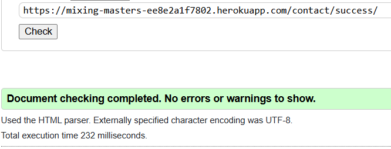 |
| courses | [admin_dashboard.html](https://github.com/Kearns55/mixing-masters/blob/main/courses/templates/courses/admin_dashboard.html) | https://validator.w3.org/nu/?doc=https%3A%2F%2Fmixing-masters-ee8e2a1f7802.herokuapp.com%2Fcourses%2Fadmin-dashboard%2F | 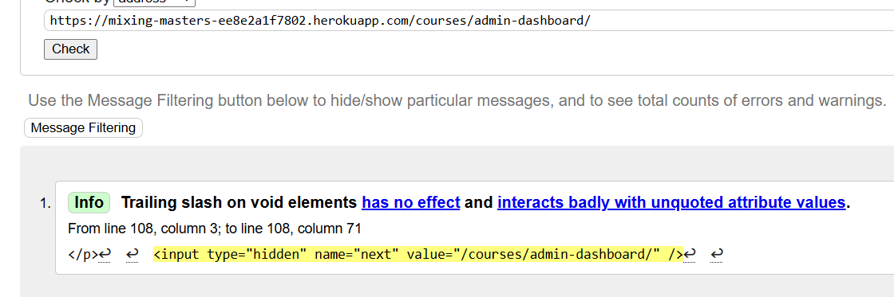 | The trailing slash comes from djangos allauth. |
| courses | [cancel.html](https://github.com/Kearns55/mixing-masters/blob/main/courses/templates/courses/cancel.html) | https://validator.w3.org/nu/?doc=https%3A%2F%2Fmixing-masters-ee8e2a1f7802.herokuapp.com%2Fcourses%2Fcancel%2F | 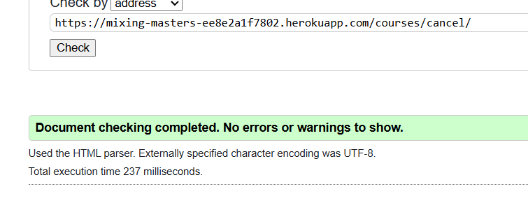 | 
| courses | [course_detail.html](https://github.com/Kearns55/mixing-masters/blob/main/courses/templates/courses/course_detail.html) | https://validator.w3.org/nu/?doc=https%3A%2F%2Fmixing-masters-ee8e2a1f7802.herokuapp.com%2Fcourses%2F5%2F | 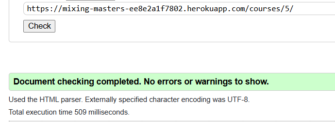 | 
| courses | [course_list.html](https://github.com/Kearns55/mixing-masters/blob/main/courses/templates/courses/course_list.html) | https://validator.w3.org/nu/?doc=https%3A%2F%2Fmixing-masters-ee8e2a1f7802.herokuapp.com%2Fcourses%2F | 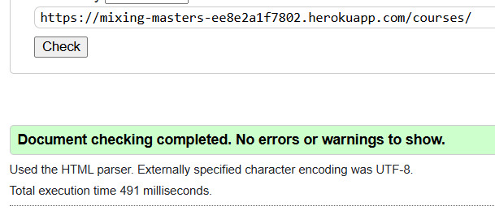 | 
| courses | [create_course.html](https://github.com/Kearns55/mixing-masters/blob/main/courses/templates/courses/create_course.html) | https://validator.w3.org/nu/?doc=https%3A%2F%2Fmixing-masters-ee8e2a1f7802.herokuapp.com%2Fcourses%2Fcreate-course%2F | 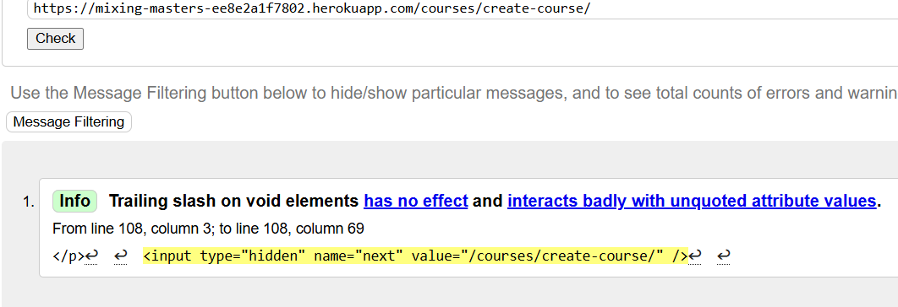 | The trailing slash comes from djangos crispy forms. |
| courses | [delete_course.html](https://github.com/Kearns55/mixing-masters/blob/main/courses/templates/courses/delete_course.html) | https://validator.w3.org/nu/?doc=https%3A%2F%2Fmixing-masters-ee8e2a1f7802.herokuapp.com%2Fcourses%2Fdelete-course%2F5%2F | 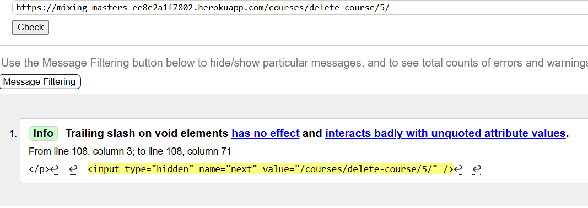 | The trailing slash comes from djangos crispy forms. |
| courses | [delete_level.html](https://github.com/Kearns55/mixing-masters/blob/main/courses/templates/courses/delete_level.html) | https://validator.w3.org/nu/?doc=https%3A%2F%2Fmixing-masters-ee8e2a1f7802.herokuapp.com%2Fcourses%2Fdelete-level%2F3%2F | 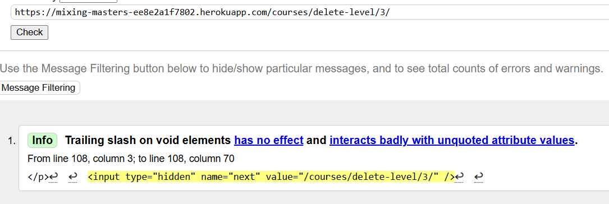 | The trailing slash comes from djangos crispy forms. |
| courses | [delete_supply.html](https://github.com/Kearns55/mixing-masters/blob/main/courses/templates/courses/delete_supply.html) | https://validator.w3.org/nu/?doc=https%3A%2F%2Fmixing-masters-ee8e2a1f7802.herokuapp.com%2Fcourses%2Fdelete-supply%2F1%2F | 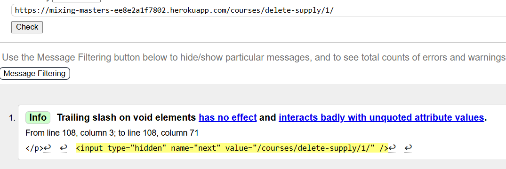 | The trailing slash comes from djangos crispy forms. |
| courses | [my_courses.html](https://github.com/Kearns55/mixing-masters/blob/main/courses/templates/courses/my_courses.html) | https://validator.w3.org/nu/?doc=https%3A%2F%2Fmixing-masters-ee8e2a1f7802.herokuapp.com%2Fcourses%2Fmy-courses%2F | 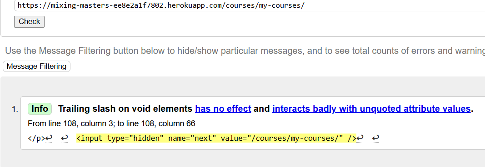 | The trailing slash comes from djangos crispy forms. | 
| courses | [success.html](https://github.com/Kearns55/mixing-masters/blob/main/courses/templates/courses/success.html) | https://validator.w3.org/nu/?doc=https%3A%2F%2Fmixing-masters-ee8e2a1f7802.herokuapp.com%2Fcourses%2Fsuccess%2F | 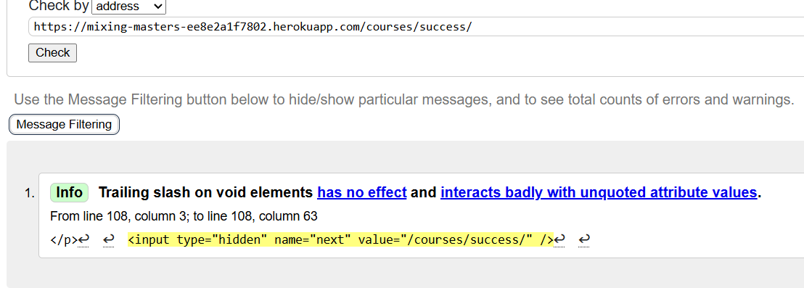 |  The trailing slash comes from djangos crispy forms. |
| courses | [update_course.html](https://github.com/Kearns55/mixing-masters/blob/main/courses/templates/courses/update_course.html) | https://validator.w3.org/nu/?doc=https%3A%2F%2Fmixing-masters-ee8e2a1f7802.herokuapp.com%2Fcourses%2Fupdate-course%2F5%2F | 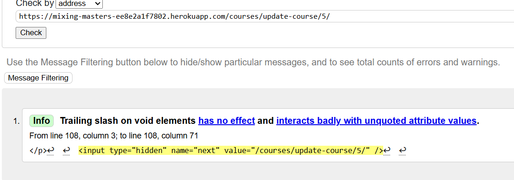 | The trailing slash comes from djangos crispy forms. |
| courses | [update_level.html](https://github.com/Kearns55/mixing-masters/blob/main/courses/templates/courses/update_level.html) | https://validator.w3.org/nu/?doc=https%3A%2F%2Fmixing-masters-ee8e2a1f7802.herokuapp.com%2Fcourses%2Fupdate-level%2F3%2F | 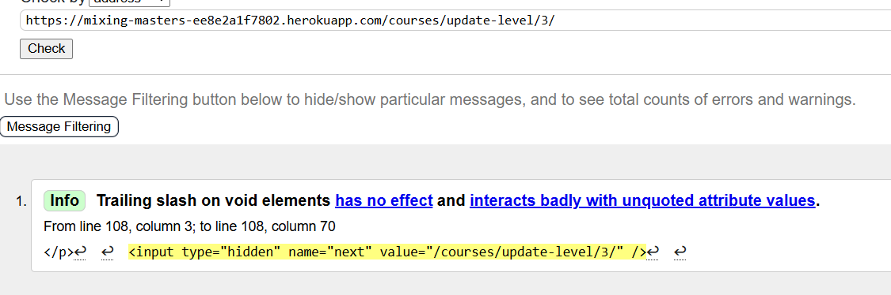 | The trailing slash comes from djangos crispy forms. |
| courses | [update_supply.html](https://github.com/Kearns55/mixing-masters/blob/main/courses/templates/courses/update_supply.html) | https://validator.w3.org/nu/?doc=https%3A%2F%2Fmixing-masters-ee8e2a1f7802.herokuapp.com%2Fcourses%2Fupdate-supply%2F1%2F | 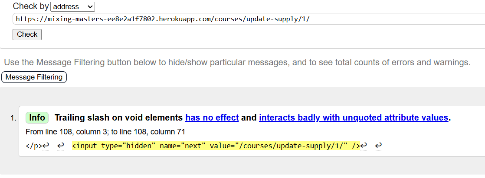 | The trailing slash comes from djangos crispy forms. |
| home | [index.html](https://github.com/Kearns55/mixing-masters/blob/main/home/templates/home/index.html) | https://validator.w3.org/nu/?doc=https%3A%2F%2Fmixing-masters-ee8e2a1f7802.herokuapp.com%2F | 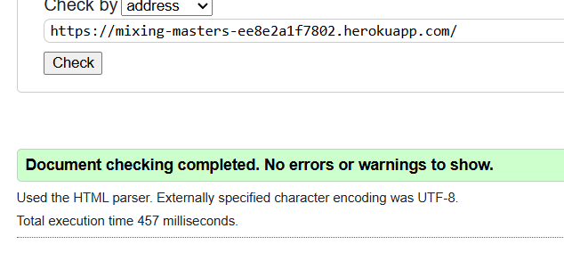 | 
| templates | [404.html](https://github.com/Kearns55/mixing-masters/blob/main/templates/errors/404.html) | https://validator.w3.org/nu/?doc=https%3A%2F%2Fmixing-masters-ee8e2a1f7802.herokuapp.com%2F404&checkerrorpages=yes | 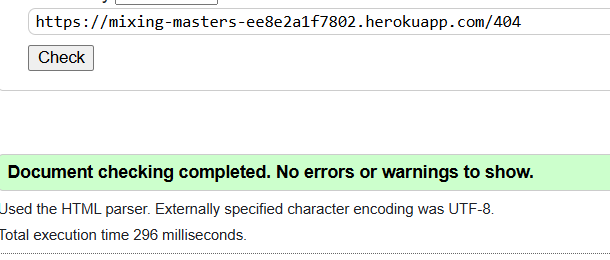 |
| templates | [email_confirm.html](https://github.com/Kearns55/mixing-masters/blob/main/templates/account/email_confirm.html) | https://validator.w3.org/nu/?doc=https%3A%2F%2Fmixing-masters-ee8e2a1f7802.herokuapp.com%2Faccounts%2Fconfirm-email%2F | 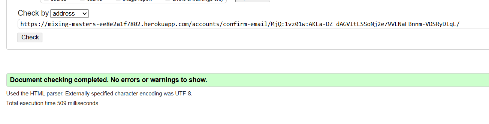 |
| templates | [login.html](https://github.com/Kearns55/mixing-masters/blob/main/templates/account/login.html) | https://validator.w3.org/nu/?doc=https%3A%2F%2Fmixing-masters-ee8e2a1f7802.herokuapp.com%2Faccounts%2Flogin%2F | 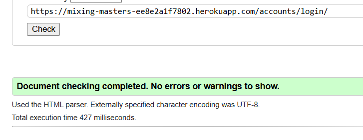 | 
| templates | [logout.html](https://github.com/Kearns55/mixing-masters/blob/main/templates/account/logout.html) | https://validator.w3.org/nu/?doc=https%3A%2F%2Fmixing-masters-ee8e2a1f7802.herokuapp.com%2Faccounts%2Flogout%2F | 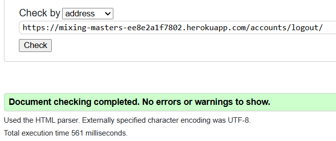 |
| templates | [signup.html](https://github.com/Kearns55/mixing-masters/blob/main/templates/account/signup.html) | https://validator.w3.org/nu/?doc=https%3A%2F%2Fmixing-masters-ee8e2a1f7802.herokuapp.com%2Faccounts%2Fsignup%2F | 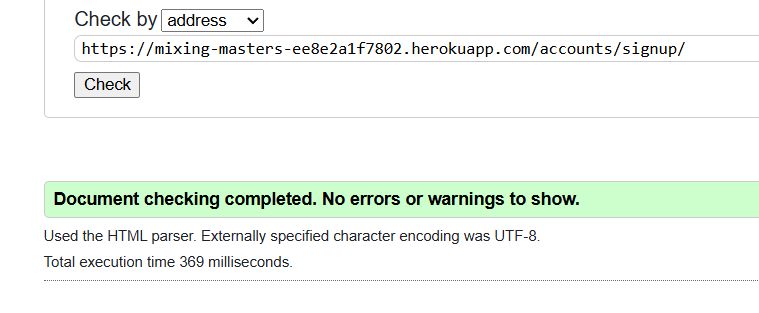 | 
| templates | [verification_sent.html](https://github.com/Kearns55/mixing-masters/blob/main/templates/account/verification_sent.html) | https://validator.w3.org/nu/?doc=https%3A%2F%2Fmixing-masters-ee8e2a1f7802.herokuapp.com%2Faccounts%2Fconfirm-email%2F | 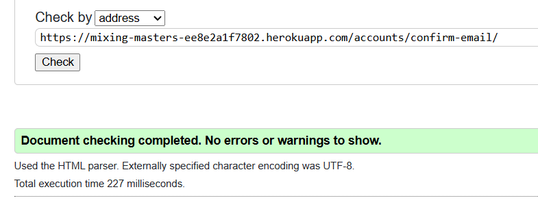 |

### CSS

I have used the recommended [CSS Jigsaw Validator](https://jigsaw.w3.org/css-validator) to validate all of my CSS files.

| Directory | File | URL | Screenshot |
| --- | --- | --- | --- | 
| static | [styles.css] | (https://github.com/Kearns55/mixing-masters/blob/main/static/css/styles.css) | 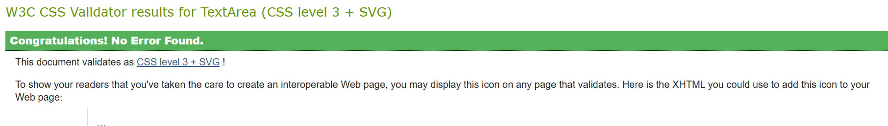 | 

### Python

I have used the recommended [PEP8 CI Python Linter](https://pep8ci.herokuapp.com) to validate all of my Python files.

| Directory | File | URL | Screenshot |
| --- | --- | --- | --- |
| contact | [admin.py](https://github.com/Kearns55/mixing-masters/blob/main/contact/admin.py) | [PEP8 CI Link](https://pep8ci.herokuapp.com/https://raw.githubusercontent.com/Kearns55/mixing-masters/main/contact/admin.py) | 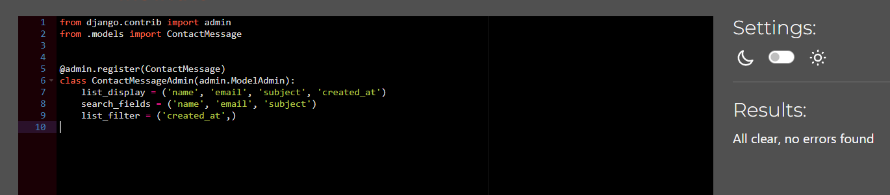 | 
| contact | [forms.py](https://github.com/Kearns55/mixing-masters/blob/main/contact/forms.py) | [PEP8 CI Link](https://pep8ci.herokuapp.com/https://raw.githubusercontent.com/Kearns55/mixing-masters/main/contact/forms.py) | 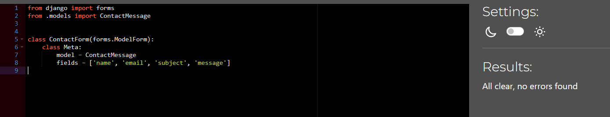 | 
| contact | [models.py](https://github.com/Kearns55/mixing-masters/blob/main/contact/models.py) | [PEP8 CI Link](https://pep8ci.herokuapp.com/https://raw.githubusercontent.com/Kearns55/mixing-masters/main/contact/models.py) | 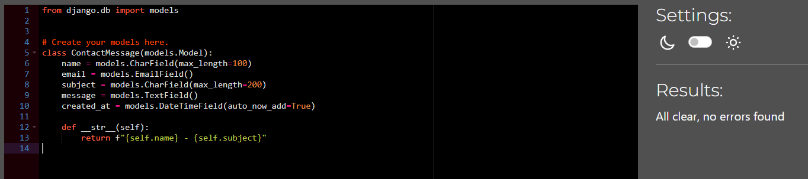 |
| contact | [urls.py](https://github.com/Kearns55/mixing-masters/blob/main/contact/urls.py) | [PEP8 CI Link](https://pep8ci.herokuapp.com/https://raw.githubusercontent.com/Kearns55/mixing-masters/main/contact/urls.py) | 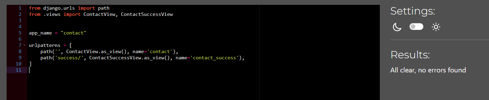 | 
| contact | [views.py](https://github.com/Kearns55/mixing-masters/blob/main/contact/views.py) | [PEP8 CI Link](https://pep8ci.herokuapp.com/https://raw.githubusercontent.com/Kearns55/mixing-masters/main/contact/views.py) | 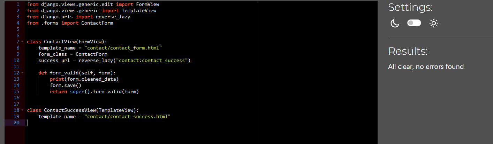 |
| courses | [admin.py](https://github.com/Kearns55/mixing-masters/blob/main/courses/admin.py) | [PEP8 CI Link](https://pep8ci.herokuapp.com/https://raw.githubusercontent.com/Kearns55/mixing-masters/main/courses/admin.py) | 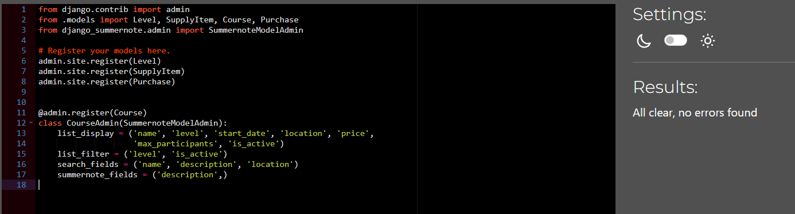 |
| courses | [forms.py](https://github.com/Kearns55/mixing-masters/blob/main/courses/forms.py) | [PEP8 CI Link](https://pep8ci.herokuapp.com/https://raw.githubusercontent.com/Kearns55/mixing-masters/main/courses/forms.py) | 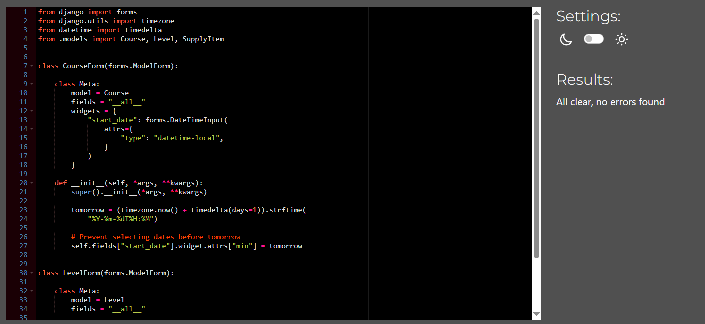 | 
| courses | [models.py](https://github.com/Kearns55/mixing-masters/blob/main/courses/models.py) | [PEP8 CI Link](https://pep8ci.herokuapp.com/https://raw.githubusercontent.com/Kearns55/mixing-masters/main/courses/models.py) | 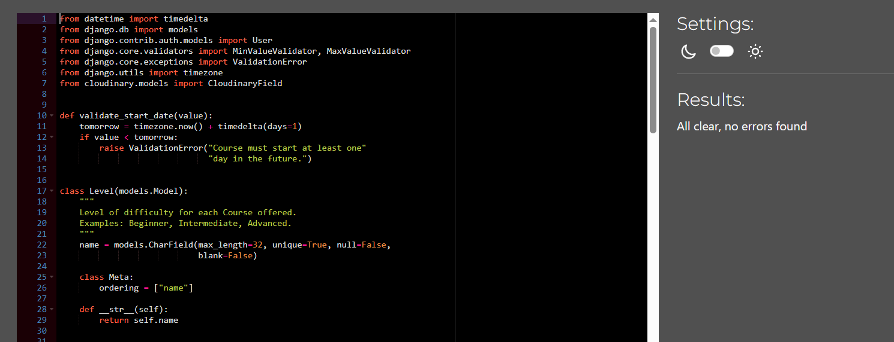 |
| courses | [server.py](https://github.com/Kearns55/mixing-masters/blob/main/courses/server.py) | [PEP8 CI Link](https://pep8ci.herokuapp.com/https://raw.githubusercontent.com/Kearns55/mixing-masters/main/courses/server.py) | 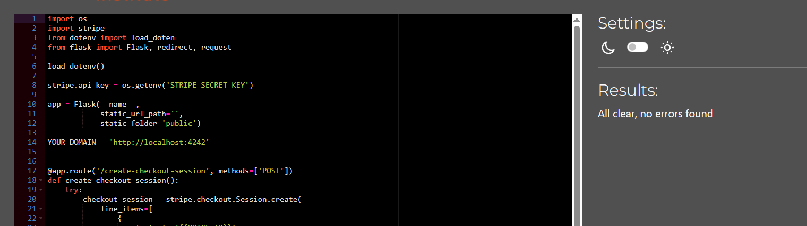 |
| courses | [urls.py](https://github.com/Kearns55/mixing-masters/blob/main/courses/urls.py) | [PEP8 CI Link](https://pep8ci.herokuapp.com/https://raw.githubusercontent.com/Kearns55/mixing-masters/main/courses/urls.py) | 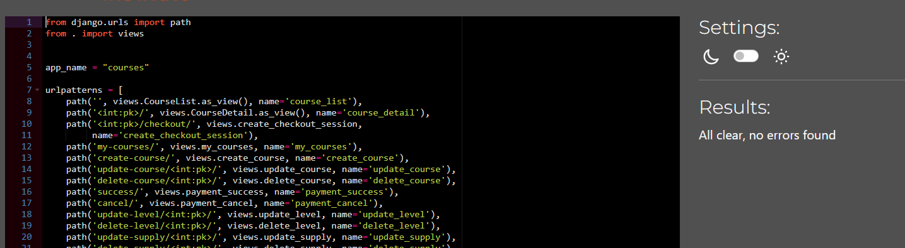 |
| courses | [views.py](https://github.com/Kearns55/mixing-masters/blob/main/courses/views.py) | [PEP8 CI Link](https://pep8ci.herokuapp.com/https://raw.githubusercontent.com/Kearns55/mixing-masters/main/courses/views.py) | 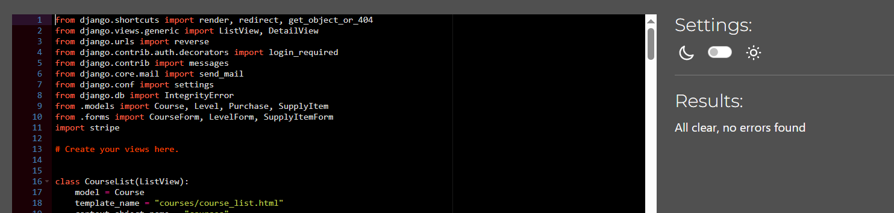 |
| home | [urls.py](https://github.com/Kearns55/mixing-masters/blob/main/home/urls.py) | [PEP8 CI Link](https://pep8ci.herokuapp.com/https://raw.githubusercontent.com/Kearns55/mixing-masters/main/home/urls.py) | 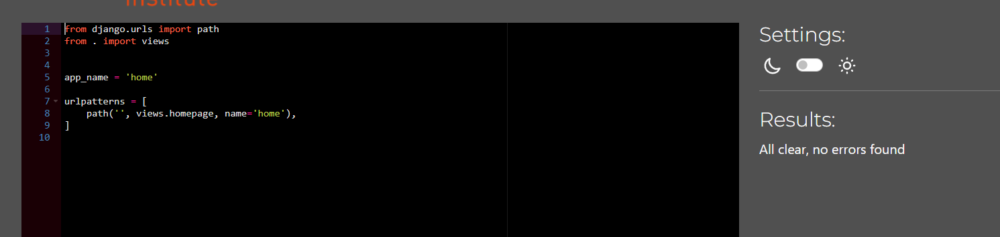 |
| home | [views.py](https://github.com/Kearns55/mixing-masters/blob/main/home/views.py) | [PEP8 CI Link](https://pep8ci.herokuapp.com/https://raw.githubusercontent.com/Kearns55/mixing-masters/main/home/views.py) | 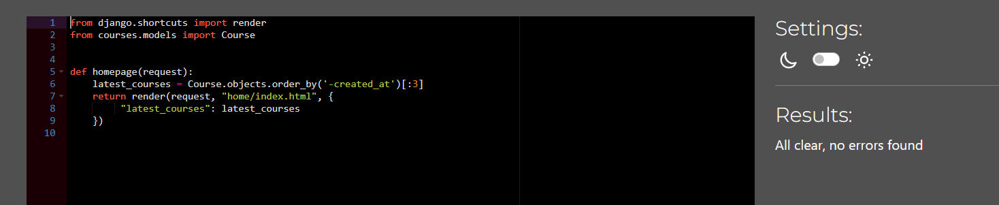 |
|  | [manage.py](https://github.com/Kearns55/mixing-masters/blob/main/manage.py) | [PEP8 CI Link](https://pep8ci.herokuapp.com/https://raw.githubusercontent.com/Kearns55/mixing-masters/main/manage.py) | 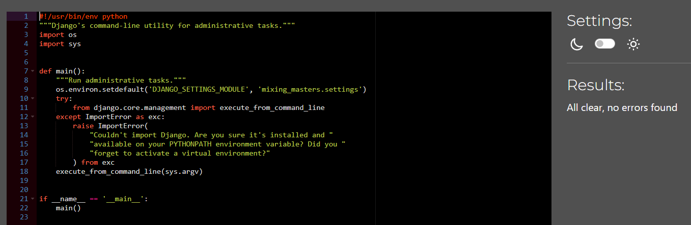 |
| mixing_masters | [settings.py](https://github.com/Kearns55/mixing-masters/blob/main/mixing_masters/settings.py) | [PEP8 CI Link](https://pep8ci.herokuapp.com/https://raw.githubusercontent.com/Kearns55/mixing-masters/main/mixing_masters/settings.py) | 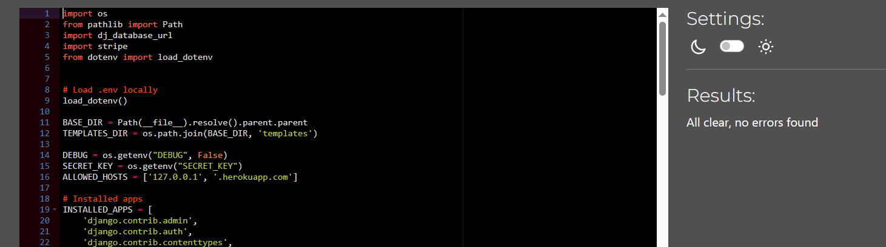 |
| mixing_masters | [urls.py](https://github.com/Kearns55/mixing-masters/blob/main/mixing_masters/urls.py) | [PEP8 CI Link](https://pep8ci.herokuapp.com/https://raw.githubusercontent.com/Kearns55/mixing-masters/main/mixing_masters/urls.py) | 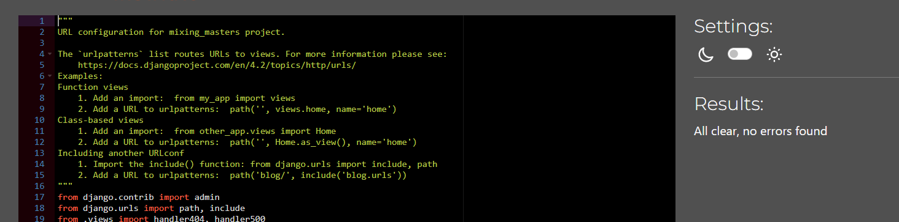 |
| mixing_masters | [views.py](https://github.com/Kearns55/mixing-masters/blob/main/mixing_masters/views.py) | [PEP8 CI Link](https://pep8ci.herokuapp.com/https://raw.githubusercontent.com/Kearns55/mixing-masters/main/mixing_masters/views.py) | 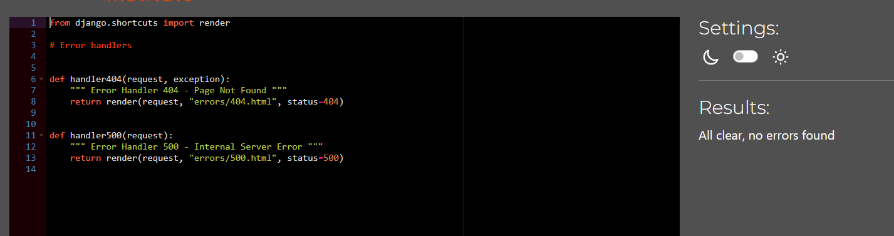 | 

## Responsiveness

I've tested my deployed project to check for responsiveness issues.

| Page | Mobile | Tablet | Desktop | Notes |
| --- | --- | --- | --- | --- |
| Register | 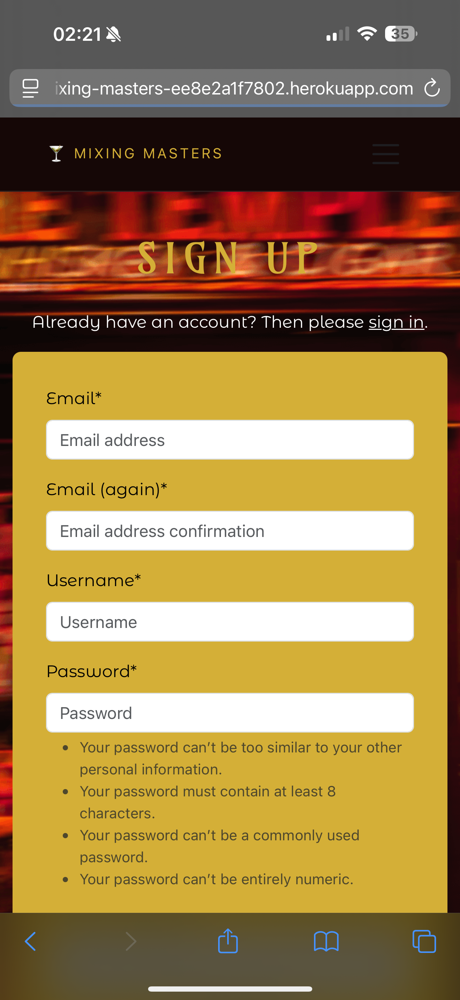 | 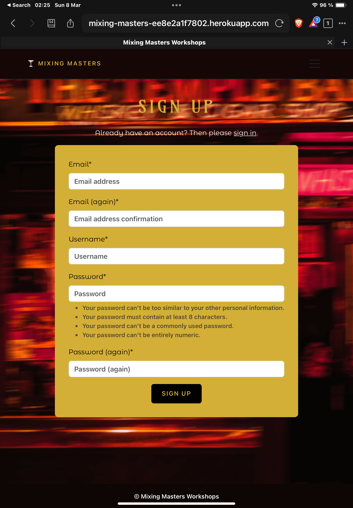 | 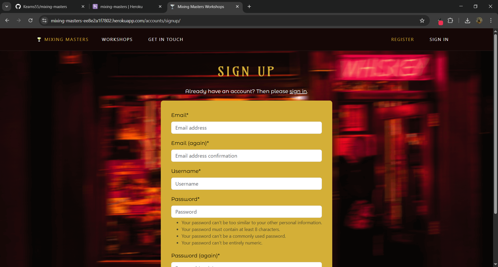 | Works as expected |
| Login | 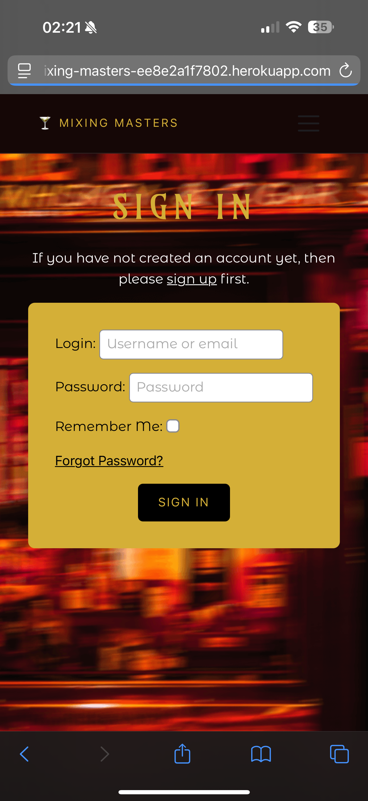 | 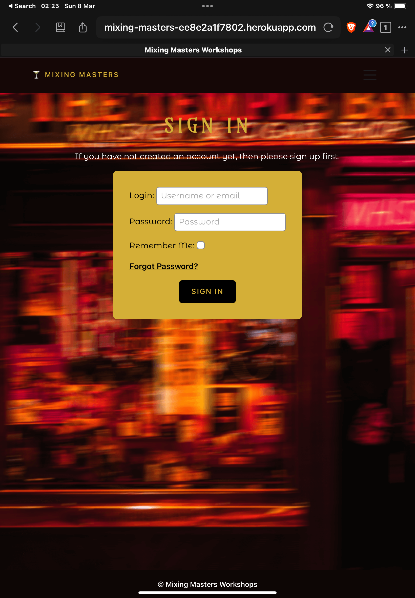 | 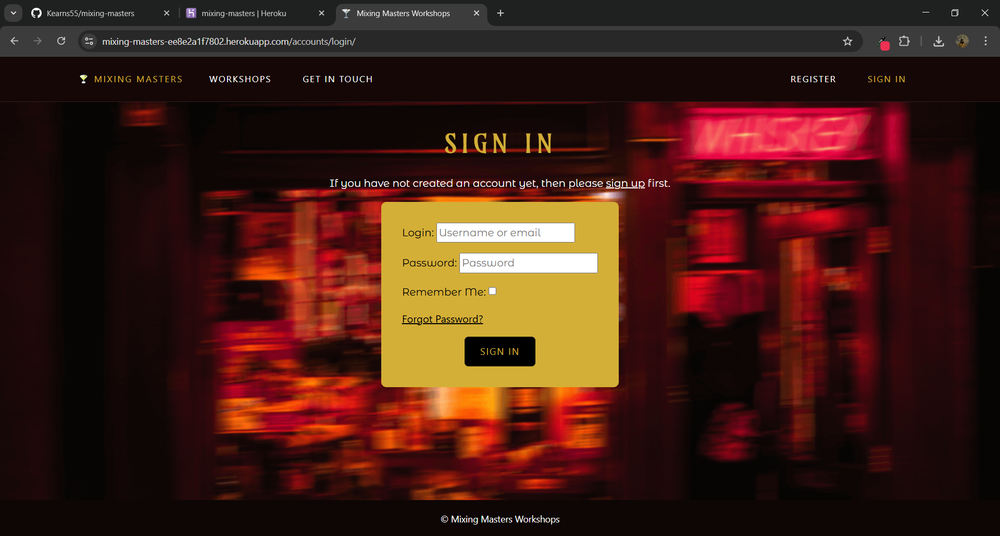 | Works as expected |
| Profile |  | 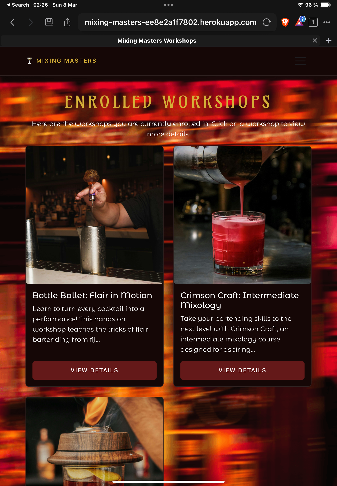 | 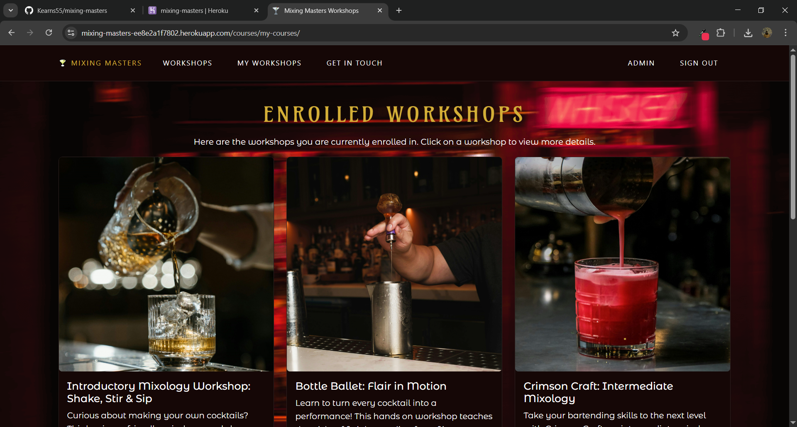 | Works as expected |
| Home | 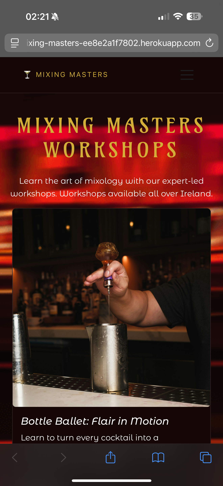 |  | 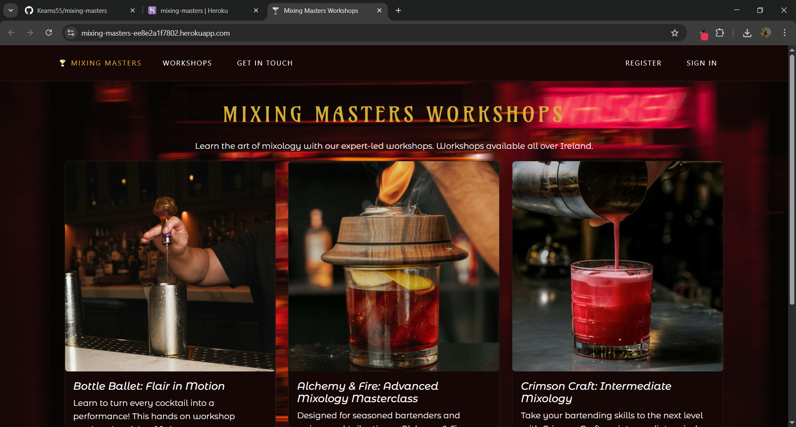 | Works as expected |
| Workshops |  |  |  | Works as expected |
| Workshop Details |  |  |  | Works as expected |
| Checkout |  |  |  | Works as expected |
| Checkout Success |  |  |  | Works as expected |
| Add workshop |  |  |  | Works as expected |
| Edit workshop |  |  |  | Works as expected |
| Contact |  |  |  | Works as expected |
| 404 |  |  |  | Works as expected |

## Browser Compatibility

I've tested my deployed project on multiple browsers to check for compatibility issues.

| Page | Chrome | Brave | Safari | Notes |
| --- | --- | --- | --- | --- |
| Register |  |  |  | Works as expected |
| Login |  |  |  | Works as expected |
| Profile |  |  |  | Works as expected |
| Home |  |  |  | Works as expected |
| Workshops |  |  |  | Works as expected |
| Workshop Details |  |  |  | Works as expected |
| Checkout |  |  |  | Works as expected |
| Checkout Success |  |  |  | Works as expected |
| Add workshop |  |  |  | Works as expected |
| Edit workshop |  |  |  | Works as expected |
| Contact |  |  |  | Works as expected |
| 404 |  |  |  | Works as expected |

## Lighthouse Audit

I've tested my deployed project using the Lighthouse Audit tool to check for any major issues. Some warnings are outside of my control, and mobile results tend to be lower than desktop.

| Page | Mobile | Desktop | Screenshot | Notes |
| --- | --- | --- | --- | --- |
| Register |  |  |
| Login |  |  |
| Home |  |  |
| Workshops |  |  |
| Workshop Details |  |  |
| Checkout |  |  |  | Stripe's checkout page running very low lighthouse scores |
| Checkout Success |  |  |
| Add workshop |  |  |
| Edit workshop |  |  |
| Contact |  |  |
| 404 |  |  |

## Defensive Programming

Defensive programming was manually tested with the below user acceptance testing:

| Page | Expectation | Test | Result | Screenshot |
| --- | --- | --- | --- | --- |
| Workshops | Feature is expected to allow users to browse workshops without registration. | Opened workshop pages as a guest user. | workshops were fully accessible without requiring registration. |  |
| | Feature is expected to show detailed workshop information. | Clicked on individual workshops to view details. | workshop details (description, price, image) were displayed correctly. |  |
| | Feature is expected to allow secure payment via Stripe. | Entered valid card details using Stripe at checkout. | Payment was processed securely, and an order confirmation page was displayed. |  |
| | Feature is expected to send a confirmation email after purchase. | Completed a purchase and checked email inbox. | Confirmation email was received with order details. |  |
| | Feature is expected to display an order confirmation page. | Completed a purchase. | Order confirmation page displayed successfully. |  |
| Account Management | Feature is expected to allow returning customers to log in and view past orders. | Logged in as a returning customer and accessed order history. | Past orders were displayed correctly in the account section. |  |
| Admin Features | Feature is expected to allow the site owner to create new workshops. | Created new workshops with valid data (name, price, description, image, category). | workshops were added successfully and displayed on the site. |  |
| | Feature is expected to allow the site owner to update workshop details. | Edited workshop details as an admin user. | workshop updates were saved and displayed correctly. |  |
| | Feature is expected to allow the site owner to delete workshops. | Deleted a workshop from the inventory. | workshop was removed successfully from the site, after being prompted to confirm first. |  |
| 404 Error Page | Feature is expected to display a 404 error page for non-existent pages. | Navigated to an invalid URL (e.g., `/test`). | A custom 404 error page was displayed as expected. |  |

## User Story Testing

| Target | Expectation | Outcome | Screenshot |
| --- | --- | --- | --- |
| As a visitor | I would like to browse available mixology courses  | so that I can decide if i want to enroll. |  |
| As a guest user | I would like to create an account | so that I can complete my purchase and track my order history. |  |
| As a customer | I would like to click on individual workshops to view more details (description, price, image, etc.) | so that I can make an informed decision about my purchase. |  |
| As a customer | I would like to receive a confirmation email after my purchase | so that I can have a record of my transaction and order details. |  |
| As a customer | I would like to see an order confirmation page after completing my purchase | so that I know my order has been successfully placed. |  |
| As a customer | I would like to securely enter my card details using Stripe at checkout | so that I can feel confident my payment information is protected. |  |
| As a returning customer | I would like to be able to log in and view the workshops I'm enrolled in | so that I can track my previous purchases. |  |
| As a site owner | I would like to create new workshops with a name, description, price, images, location, supplies and levels | so that I can add additional items to the sites inventory. |  |
| As a site owner | I would like to update workshop details (name, price, description, image etc.) at any time | so that I can keep my workshop listings accurate and up to date. |  |
| As a site owner | I would like to delete workshops that are no longer available or relevant | so that I can maintain a clean and accurate inventory. |  |
| As a user | I would like to see a 404 error page if I get lost | so that it's obvious that I've stumbled upon a page that doesn't exist. |  |

## Bugs

### Fixed Bugs

I've used [GitHub Issues](https://www.github.com/Kearns55/mixing-masters/issues) to track and manage bugs and issues during the development stages of my project.

All previously closed/fixed bugs can be tracked [here](https://www.github.com/Kearns55/mixing-masters/issues?q=is%3Aissue+is%3Aclosed+label%3Abug).


### Known Issues

| Issue | Screenshot |
| --- | --- |
| The project is designed to be responsive from `375px` and upwards, in line with the material taught on the course LMS. Minor layout inconsistencies may occur on extra-wide (e.g. 4k/8k monitors), or smart-display devices (e.g. Nest Hub, Smart Watches, Gameboy Color, etc.), as these resolutions are outside the project’s scope, as taught by Code Institute. |  |
| With a known order-number, users can brute-force "checkout_success.html" and see potentially sensitive information. |  |

> [!IMPORTANT]  
> There are no remaining bugs that I am aware of, though, even after thorough testing, I cannot rule out the possibility.

